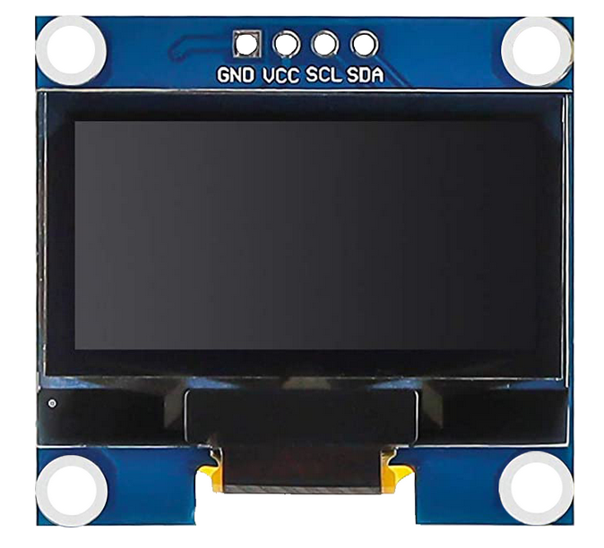
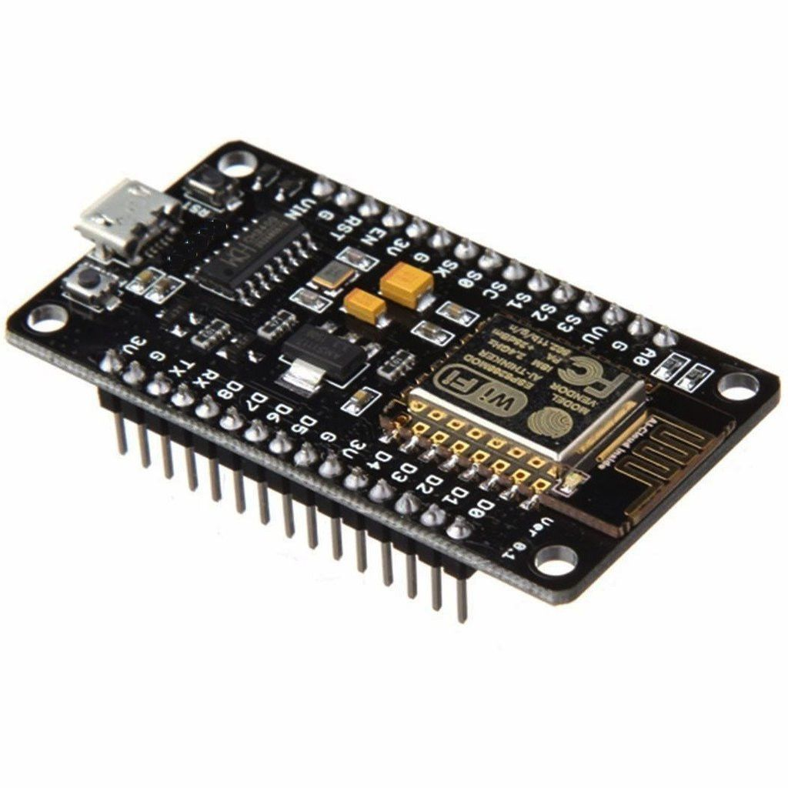
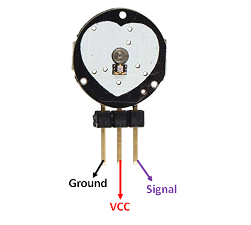
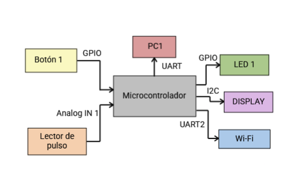
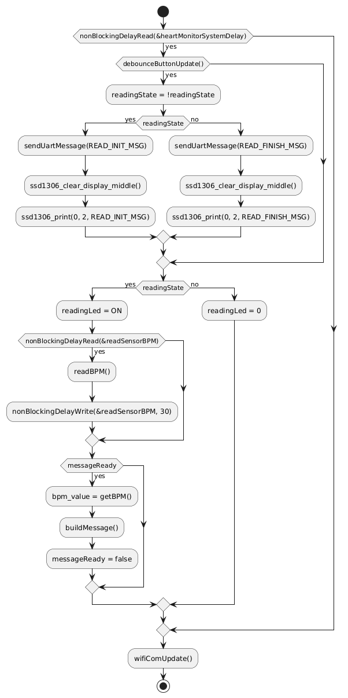

# Memoria del Trabajo Final: Sistema de Monitoreo de Frecuencia Cardiaca

**Universidad de Buenas Aires**
**Facultad de Ingeniería**
**86.65 Sistemas Embebidos**

**Autor:** Aguirre Godoy Sergio

**Padrón:** 96953

*Este trabajo fue realizado en la Ciudad de Buenos Aires entre Mayo y Agosto de 2025.*

## Resumen
Este proyecto presenta el desarrollo de un sistema embebido para el monitoreo continuo de la frecuencia cardíaca, implementado con la placa de desarrollo STM32 Nucleo-F429ZI. 
El sistema emplea un sensor fotodetector para la medición del pulso, permitiendo una adquisición en tiempo real de los datos fisiológicos del usuario. 
Incorpora una visualizacion basada en un display. La conectividad Wi-Fi facilita la transmisión de datos hacia plataformas externas para visualización remota, y permite configurar umbrales de alerta personalizables, mejorando así su adaptabilidad a distintos perfiles clínicos o deportivos. La capacidad de almacenamiento local permite el registro histórico de mediciones para análisis posterior. El diseño del sistema prioriza la modularidad del software y la integración de componentes, con el objetivo de ofrecer una solución compacta de bajo costo para aplicaciones en telemedicina y monitoreo personal de la salud.

## Tabla de Contenidos

- [1. Introducción](#1-introducción-general)
- [2. Introducción Específica](#capítulo-2-Introducción-específica)
- [3. Diseño e Implementación](#capítulo-3-Diseño-e-implementación)
- [4. Ensayos y resultados](#capítulo-4-Ensayos-y-resultados)
- [5. Conclusiones](#capı́tulo-5-conclusiones)

## Registro de versiones

| **Revisión** | **Cambios realizados** |  **Fecha** |
|:------------:|:----------------------:|:----------:|
|       1      | Creación del documento | 11/07/2025 |
|       2      |                        |            |
|       3      |                        |            |

## 1. Introducción general

### 1.1. Objetivo
  Desarrollar un sistema embebido portátil para el monitoreo de la frecuencia cardíaca en el hogar, que permita al usuario controlar su pulso en tiempo real y almacenar registros históricos accesibles de forma remota por profesionales de la salud.

### 1.2. Introducción
El monitoreo de la frecuencia cardíaca es una herramienta fundamental para el cuidado de la salud, ya que permite detectar a tiempo alteraciones en el ritmo del corazón que podrían ser indicio de enfermedades cardiovasculares. Si bien existen dispositivos comerciales para esta tarea, muchos de ellos presentan limitaciones en cuanto a accesibilidad, personalización o posibilidad de seguimiento remoto por parte de profesionales médicos.

El presente proyecto aborda esta problemática mediante el desarrollo de un sistema embebido que permite a cualquier persona controlar su pulso desde su hogar de forma sencilla, confiable y económica. El sistema utiliza sensores ópticos (fotodetectores) para medir el ritmo cardíaco en tiempo real y cuenta con una pantalla para visualizar la información y configurar umbrales de alerta según las necesidades del usuario. Además, se integra con una red Wi-Fi, lo que posibilita el envío de los datos registrados a plataformas externas, donde pueden ser consultados por médicos u otros profesionales de la salud para realizar un seguimiento histórico del paciente.

Este proyecto se destaca especialmente por combinar monitoreo local e inalámbrico en un solo dispositivo portátil, accesible y personalizable. Esto lo diferencia de otros sistemas similares, que suelen estar pensados para un entorno clínico cerrado o requieren dispositivos adicionales para transmitir los datos. 
También se valoró la facilidad de acceso a los componentes electrónicos utilizados, la escalabilidad del diseño para adaptarlo a diferentes contextos (hogar, clínica, institución), y su potencial impacto social, al contribuir a la prevención y detección temprana de problemas cardíacos.

Con esta propuesta, se busca acercar la tecnología al cuidado cotidiano de la salud, potenciando el rol del monitoreo domiciliario dentro del ecosistema de soluciones de telemedicina e Internet de las Cosas (IoT).

### 1.2. Análisis de sistemas similares en el mercado

Se analizaron cuatro productos de monitoreo cardiaco. Se muestra la comparación de características en la Tabla 2.1.

<table border="1" cellspacing="0" cellpadding="5">
    <thead>
        <tr>
            <th>Característica</th>
            <th> [MAGENE H303](https://www.magene.com/en/sensors/52-h303-heart-rate-monitor.html)</th>
            <th>[POLAR Verity Sense](https://www.polar.com/us-en/products/accessories/polar-verity-sense)</th>
            <th>[WELLUE O2Ring](https://getwellue.com/pages/o2ring-oxygen-monitor)</th>
            <th>[Wellue Oxiband](https://www.mercadolibre.com.ar/oximetro-de-pulso-wellue-oxiband-con-app-y-recordatorio/p/MLA50740493)</th>
        </tr>
    </thead>
    <tbody>
        <tr>
            <td>Tipo de sensor</td>
            <td>Banda torácica con sensor ECG</td>
            <td>Banda óptica para brazo (PPG)</td>
            <td>Anillo con sensor óptico (PPG)</td>
            <td>Sensor óptico PPG para SpO2 y pulso</td>
        </tr>
        <tr>
            <td>Rango frecuencia cardíaca</td>
            <td>30 - 240 bpm</td>
            <td>30 - 220 bpm</td>
            <td>No especificado (pulso y SpO2)</td>
            <td>30 - 250 bpm</td>
        </tr>
        <tr>
            <td>Duración batería</td>
            <td>Hasta 1000 horas</td>
            <td>Hasta 20 horas</td>
            <td>Hasta 14 horas</td>
            <td>Aproximadamente 8 horas</td>
        </tr>
        <tr>
            <td>Tipo de batería</td>
            <td>Pila botón CR2032</td>
            <td>Batería recargable integrada</td>
            <td>Batería recargable integrada</td>
            <td>Batería recargable integrada</td>
        </tr>
        <tr>
            <td>Conectividad inalámbrica</td>
            <td>Bluetooth 4.2 y ANT+</td>
            <td>Bluetooth 5.0</td>
            <td>Bluetooth 4.0</td>
            <td>Bluetooth 4.0</td>
        </tr>
        <tr>
            <td>Impermeabilidad</td>
            <td>IP67 (resistente al agua y polvo)</td>
            <td>Resistente al agua (IPX7)</td>
            <td>IP24 (resistente a salpicaduras)</td>
            <td>No especificado</td>
        </tr>
        <tr>
            <td>Display</td>
            <td>No incluye display (se conecta a apps o dispositivos externos)</td>
            <td>No incluye display (se conecta a apps)</td>
            <td>No incluye display (datos en app)</td>
            <td>Sí, display OLED integrado</td>
        </tr>
        <tr>
            <td>Audio / alertas</td>
            <td>No incluye</td>
            <td>No incluye</td>
            <td>Vibración para alertas</td>
            <td>Alarmas sonoras y visuales</td>
        </tr>
        <tr>
            <td>Precio aproximado</td>
            <td>$30 - $40 USD</td>
            <td>$90 - $120 USD</td>
            <td>$150 - $200 USD</td>
            <td>$600 - $800 USD</td>
        </tr>
        <tr>
            <td>Uso principal</td>
            <td>Monitoreo deportivo y fitness</td>
            <td>Monitoreo deportivo y salud continua</td>
            <td>Monitoreo médico de SpO2 y pulso</td>
            <td>Monitoreo médico de SpO2 y frecuencia cardíaca</td>
        </tr>
    </tbody>
</table>

<em>Tabla 2.1: Comparación de productos de mercado</em>

## Capítulo 2. Introducción específica

### 2.1. Requisitos

En la tabla 2.1 se muestran los requisitos del sistema desarrollado.

| Grupo         | ID   | Descripción                                                                                                         |
| :------------ | :----| :------------------------------------------------------------------------------------------------------------------|
| Monitoreo       | 1.1   | El sistema sensará la frecuencia cardíaca en tiempo real mediante un sensor integrado al dispositivo.               |
|                 | 1.2   | El sistema almacenará localmente los datos de frecuencia cardíaca para asegurar la continuidad en caso de desconexión.|
| Visualización   | 2.1   | El dispositivo mostrará en su display local la frecuencia cardíaca en tiempo real, con valores numéricos. |
|                 | 2.2   | La aplicación web y móvil permitirá visualizar la frecuencia cardíaca en tiempo real mediante valores numéricos actualizados cada cinco segundos, asegurando sincronización continua con el dispositivo. |
|                 | 2.3   | La aplicación almacenará y mostrará datos históricos de frecuencia cardíaca, permitiendo al usuario consultar tendencias diarias, semanales y mensuales. |
| Alertas         | 3.1   | El sistema debe detectar eventos anómalos (frecuencia fuera de rango) y generar alertas visuales y notificaciones. |
|                 | 3.2   | El sistema enviará notificaciones inmediatas a la aplicacion web cuando se detecten anomalías.    |
| Configuración   | 4.1   | El sistema permitirá configurar parámetros como umbrales de alerta y etiqueta de usuario desde la aplicación remota. |
| Comunicación    | 5.1   |El sistema contará con una aplicación web accesible vía navegador desde dispositivos móviles y de escritorio. La aplicación permitirá monitorear datos en tiempo real y recibir notificaciones |
| Proyecto        | 6.1   | El prototipo será acompañado de la lista de partes, el repositorio de código con su documentación, y un manual de uso. |

<em>Tabla 2.1: Requisitos del proyecto</em>

**Tabla 2.1: Requisitos del sistema automático.**

### 2.2. Casos de uso
En las tablas 2.2, 2.3 y 2.4 se presentan tres casos de uso del sistema representativos de su funcionalidad.

| Elemento         | Definición                                                    |
| :--------------- | :------------------------------------------------------------|
| Causa            | Se quiere leer datos de pulso en tiempo real.                |
| Precondición     | El sistema está iniciado y el sensor de pulso está activo.   |
| Flujo básico     | Se debe presionar el botón de usuario para iniciar la lectura en tiempo real. El sistema muestra el pulso en el display y puerto serie, y lo transmite vía Wi-Fi. |
| Flujo alternativo| Si no se presiona el botón, el sistema permanece en modo espera.  |

<em>Tabla 2.2: Caso de uso 1: Lectura de datos de pulso en tiempo real</em>

---

| Elemento         | Definición                                                    |
| :--------------- | :------------------------------------------------------------|
| Causa            | El usuario desea revisar el historial y tendencias de la frecuencia cardíaca. |
| Precondición     | El dispositivo ha estado registrando y sincronizando datos con la aplicación web. |
| Flujo básico     | El usuario accede a la aplicación web, selecciona `Datos Historicos` y visualiza los reportes de datos históricos. |
| Flujo alternativo| Si no hay datos almacenados, se muestra un mensaje indicando que no hay registros disponibles. |

<em>Tabla 2.3: Caso de uso 2: Visualización y análisis de datos históricos</em>

---

| Elemento         | Definición                                                    |
| :--------------- | :------------------------------------------------------------|
| Causa            | El usuario quiere modificar parámetros  de forma remota. |
| Precondición     | El dispositivo está conectado a la red Wi-Fi y sincronizado con la aplicación. |
| Flujo básico     | El usuario accede a la aplicación, modifica parámetros (umbrales,  etiqueta de usuario). El dispositivo recibe y aplica los cambios automáticamente. |
| Flujo alternativo| Si la conexión falla durante la actualización, el dispositivo mantiene la configuración anterior. |

<em>Tabla 2.4: Caso de uso 3: Configuración de parámetros</em>

### 2.3. Descripción de módulos utilizado

En base a la arquitectura de control y los requisitos establecidos se decidió por utilizar los módulos que se
describen a continuación.

#### 2.3.2. Módulo del display grafico
Para la implementación del HMI se utilizó el módulo display SSD1306 [2] con pantalla OLED de 0.96’ que se muestra en la figura 2.2.
El comando gráfico del OLED se realiza a través de una comunicación I2C.

    

<em>Figura 2.1: Modulo display OLED SSD1306</em>

Para poder dibujar los caracteres en este display, se hizo uso de la definicion de variables proporcionada por la biblioteca Lexus2k [4].

#### 2.3.3. Módulo Wi-Fi
Para la implementación de la comunicación con la computadora de supervisión a través de un navegador web
se utiliza el módulo Wi-Fi ESP12F incluido en la placa NODEMCU ESP8266 [2] de la figura 2.3.
Este módulo se comunica con el microcontrolador a través de una interfaz UART y la configuración del mismo
se realiza a través de comandos AT.

    

<em>Figura 2.2: Modulo Wi-Fi NodeMCU ESP8266</em>

#### 2.3.4.  Sensor de pulso cardiaco.
El modulo HW-827 [1] mostrado en la figura 2.3 es un sensor óptico que permite medir la frecuencia cardíaca 
utilizando un LED infrarrojo y un fotodiodo. Detecta los cambios en la intensidad de la luz reflejada por 
el flujo sanguíneo en el dedo del usuario, generando señales analógicas que pueden procesarse para calcular 
el ritmo cardíaco.

    

<em>Figura 2.3:Sensor de pulso cardiaco</em>

## Capítulo 3. Diseño e implementación

### 3.1.Hardware

#### 3.1.1. Diagrama en bloques

En la Figura 3.1 se muestra un diagrama del hardware del sistema desarrollado.

    

<em>Figura 3.1: Diagrama en bloque del sistema</em>

#### 3.1.2. Lista de señales
En la tabla 3.1 se listan las señales del sistema, indicando la conexión de los puertos de la placa NUCLEO-
F429ZI a los módulos de hardware.

<table style="width: 415px;">
<thead>
<tr style="height: 23px;">
<th style="height: 23px; width: 202px;" colspan="2">Pin del m&oacute;dulo de hardware</th>
<th style="height: 23px; width: 208px;" colspan="2">Pin de la placa Nucleo-F429ZI</th>
</tr>
</thead>
<tbody>
<tr style="height: 23px;">
<td style="height: 92px; width: 132.467px;" rowspan="4">SSD1306</td>
<td style="height: 23px; width: 69.5333px;">SCL</td>
<td style="height: 23px; width: 69px;">PB_8</td>
<td style="height: 23px; width: 139px;">I2C1_SCL</td>
</tr>
<tr style="height: 23px;">
<td style="height: 23px; width: 69.5333px;">SDA</td>
<td style="height: 23px; width: 69px;">PB_9</td>
<td style="height: 23px; width: 139px;">I2C1_SDA</td>
</tr>
<tr style="height: 23px;">
<td style="height: 23px; width: 69.5333px;">VCC</td>
<td style="height: 23px; width: 69px;">3V3</td>
<td style="height: 23px; width: 139px;">3V3</td>
</tr>
<tr style="height: 23px;">
<td style="height: 23px; width: 69.5333px;">GND</td>
<td style="height: 23px; width: 69px;">GND</td>
<td style="height: 23px; width: 139px;">GND</td>
</tr>
<tr style="height: 23px;">
<td style="height: 69.5px; width: 132.467px;" rowspan="3">HW-827</td>
<td style="height: 23px; width: 69.5333px;">VCC</td>
<td style="height: 23px; width: 69px;">3V3</td>
<td style="height: 23px; width: 139px;">3V3</td>
</tr>
<tr style="height: 23.5px;">
<td style="height: 23.5px; width: 69.5333px;">SIGNAL</td>
<td style="height: 23.5px; width: 69px;">PA_3</td>
<td style="height: 23.5px; width: 139px;">A0</td>
</tr>
<tr style="height: 23px;">
<td style="height: 23px; width: 69.5333px;">GND</td>
<td style="height: 23px; width: 69px;">GND</td>
<td style="height: 23px; width: 139px;">GND</td>
</tr>
<tr style="height: 23px;">
<td style="height: 92px; width: 132.467px;" rowspan="4">NODEMCU8266</td>
<td style="height: 23px; width: 69.5333px;">TX</td>
<td style="height: 23px; width: 69px;">PE_9</td>
<td style="height: 23px; width: 139px;">&nbsp;UART7_RX</td>
</tr>
<tr style="height: 23px;">
<td style="height: 23px; width: 69.5333px;">RX</td>
<td style="height: 23px; width: 69px;">PE_8</td>
<td style="height: 23px; width: 139px;">&nbsp;UART7_TX</td>
</tr>
<tr style="height: 23px;">
<td style="height: 23px; width: 69.5333px;">VIN</td>
<td style="height: 23px; width: 69px;">5V</td>
<td style="height: 23px; width: 139px;">5V</td>
</tr>
<tr style="height: 23px;">
<td style="height: 23px; width: 69.5333px;">GND</td>
<td style="height: 23px; width: 69px;">GND</td>
<td style="height: 23px; width: 139px;">&nbsp;GND</td>
</tr>
</tbody>
</table>

&nbsp;

<em>Tabla 3.1: Lista de señales del sistema</em>

### 3.2. Firmware

#### 3.2.1. Repositorio
Todo el código del proyecto se encuentra en el repositorio git en [3].

#### 3.2.2. Tecnologı́a
El sistema se encuentra implementado en C++ utilizando Mbed. El firmware presenta un archivo main.cpp el cual lo único que realiza es llamar a las funciones inicio de sistema, y en el lazo principal, la funcion de actualizacion del sistema.

#### 3.2.3. Estructura del repositorio

| Directorio/Archivo        | Contenido principal                                          |
|-------------------|--------------------------------------------------------------|
| `SE_1c2025_TP1/`            | Archivos fuente del proyecto                                 |
| `SE_1c2025_TP1/modules/button/`       | Control de botón de usuario con maquina de estados      |
| `SE_1c2025_TP11/modules/display/`    | Funciones gráficas para el display SSD1306                   |
| `SE_1c2025_TP1/modules/heart_monitor_system/` | Lógica principal y configuración del sistema     |
| `SE_1c2025_TP1/modules/pulse_sensor/`    | Funciones de control de sensor de pulso cardiaco         |
| `SE_1c2025_TP1/modules/serial_com/`    | Funciones de escritura por puerto serie                 |
| `SE_1c2025_TP1/modules/wifi_com/`    | Funciones de control de modulo Wi-Fi por puerto serie                 |
| `SE_1c2025_TP1/modules/data_history/`    | Funciones para guardar registros historicos       |
| `SE_1c2025_TP1/main.cpp`    | Archivo principal de ejecución          |
| `SE_1c2025_TP1/mbed_app.json`    | Archivo de configuracion para el compilador     |

<em>Tabla 3.2: Estructura de directorios y modulos</em>

| Nombre de elemento        | Tipo                          |      Descripción   |
|-------------------|-----------------------|---------------------------------------|
| hw827         | Objeto AnalogIn      | Se usa para leer la etrada analogica A0 de la placa Nucleo donde se conecta el HW-827.      |
| bpm         | Variable float      | Se usa guardar valores finales calculados de bpm (usa valor anterior).      |
| bpm_actual         | Variable float      | Se usa guardar el valor calculado actual de bpm.      |
| intervals         | Variable uint32      | Guarda los ultimos cuatro valores de intervalos entre pulsos.     |

<em>Tabla 3.3: Objetos y Variables del modulo pulse_sensor</em>

| Nombre de elemento        | Tipo                          |      Descripción   |
|-------------------|-----------------------|---------------------------------------|
| i2c         | Objeto I2C      | Se usa para la comunicacion I2C donde se conecta el SSD1306.      |

<em>Tabla 3.4: Objetos y Variables del modulo display</em>

| Nombre de elemento        | Tipo                          |      Descripción   |
|-------------------|-----------------------|---------------------------------------|
| wifiComState_t         | Typedef      | Se usa para informar el estado de la maquina de estados de comunicacion Wi-Fi.      |
| uartWifi         | Objeto UnbufferedSerial      | Se usa para la comunicacion serie del modulo NODEMCU8266      |

<em>Tabla 3.5: Objetos y Variables del modulo wifi_com</em>

| Nombre de elemento        | Tipo                          |      Descripción   |
|-------------------|-----------------------|---------------------------------------|
| buttonState_t         | Typedef      | Se usa para informar el estado de la maquina de estados de pulsado de boton.      |
| button         | Objeto DigitalIn      | Se usa para detectar estado del boton de usuario BUTTON1     |

<em>Tabla 3.6: Objetos y Variables del modulo button</em>

A partir de la tabla 3.7 a tabla 3.12 se presentan las funciones publicas de cada modulo.

| Nombre de la función        | Descripción                          |      Archivo que lo usa   |
|-------------------|-----------------------|---------------------------------------|
| heartMonitorSystemInit()         | Inicializa todos los modulos y configuración inicial del sistema.      | main.cpp   |
| heartMonitorSystemUpdate()        | Se encarga la logica del programando llamando a funciones de actualización.      | main.cpp   |

<em>Tabla 3.7: Funciones publicas del modulo heart_monitor_system</em>

| Nombre de la función        | Descripción                          |      Archivo que lo usa   |
|-------------------|-----------------------|---------------------------------------|
| readBPM()         | Calcula un valor de lectura de pulso cardiaco      | heart_monitor_system.cpp   |
| getBPM()        | Entrega el valor obtenido del ultimo calculo de pulso cardiaco      | heart_monitor_system.cpp y wifi_com.cpp   |

<em>Tabla 3.8: Funciones publicas del modulo pulse_sensor</em>

| Nombre de la función        | Descripción                          |      Archivo que lo usa   |
|-------------------|-----------------------|---------------------------------------|
| ssd1306_init()         | Inicializa el display OLED SSD1306      | heart_monitor_system.cpp   |
| ssd1306_clear_display()        | Borra toda la pantalla del display      | heart_monitor_system.cpp   |
| ssd1306_print()        | Imprime caracteres en display considerando posicion    | heart_monitor_system.cpp   |
| ssd1306_clear_display_middle()       | Borra parte media o central del display (lectura de BPM)     | heart_monitor_system.cpp   |
| ssd1306_clear_top_rows()        | Borra parte superior del display (alertas)      | heart_monitor_system.cpp  |

<em>Tabla 3.9: Funciones publicas del modulo display</em>

| Nombre de la función        | Descripción                          |      Archivo que lo usa   |
|-------------------|-----------------------|---------------------------------------|
| debounceButtonInit()         | Inicia el  estado inicial del boton de usuario      | heart_monitor_system.cpp   |
| debounceButtonUpdate()        | Actualiza estado de boton mediante una maquina de estados      | heart_monitor_system.cpp   |

<em>Tabla 3.10: Funciones publicas del modulo button</em>

| Nombre de la función        | Descripción                          |      Archivo que lo usa   |
|-------------------|-----------------------|---------------------------------------|
| addRegisterData()         | Agrega una lectura al registro de lecturas con fecha y hora     | heart_monitor_system.cpp   |

<em>Tabla 3.11: Funciones publicas del modulo data_history</em>

| Nombre de la función        | Descripción                          |      Archivo que lo usa   |
|-------------------|-----------------------|---------------------------------------|
| wifiComInit()         | Inicia el modulo Wi-Fi mediante comandos AT      | heart_monitor_system.cpp   |
| wifiComUpdate()      | Actualiza la conexion Wi-Fi mediante una maquina de estados      | heart_monitor_system.cpp   |

<em>Tabla 3.12: Objetos y Variables del modulo wifi_com</em>

#### 3.2.6. Arquitectura
En la figura 3.3 se muestra el diagrama de flujo del firmware.

    

 

<em>Figura 3.3: Diagrama de flujo principal del firmware</em>

## Capítulo 4. Ensayos y resultados

### 4.1. Pruebas funcionales del hardware
Las pruebas funcionales del hardware se realizaron por módulos.

### 4.1.1. Módulo Wi-Fi NODEMCU8266
Se cargo el firmware AT en el modulo. Luego por conexion USB y comunicacion por el puerto serie se constato el correcto envio de comandos y sus respuestas. Ademas, mediante esos comandos se estableció conexion con la red usada por defecto.

### 4.1.2. Módulo Sesor de pulso HW-827
El estudio inició con la toma de una medida de la señal analógica a través de un osciloscopio, con el propósito de analizar tanto los niveles como el comportamiento de dicha señal durante la lectura de pulsos. Para ello, se procedió a la conexión de la señal a los 3,3 V y GND de la placa núcleo, evidenciándose la presencia de picos de amplitud asociados a la detección de pulsos, junto con la observación de ruido de interferencia superpuesto en la señal. 
Posteriormente, se llevó a cabo un experimento adicional empleando la placa núcleo junto con el software SerialPlot. A través de esta herramienta, se lograron determinar la frecuencia de muestreo óptima, los umbrales de detección y los filtros necesarios para asegurar una correcta lectura de pulsos.

### 4.1.3. Modulo Display OLED SSD1306

Para este caso se evaluaron las funciones desarrolladas de escritura y borrado, visualizando la pantalla del display. Se constato que los datos en la pantalla fueran los correctos y luego el borrado de pantalla.

### 4.1.8. Pruebas de integracion
Las pruebas de integración realizadas se encuentran en formato de video en el siguiente enlace:

Donde se verificó:
* Disposición del hardware.
* Lógica del funcionamiento del sistema.
* Comandos por puerto serie.
* Monitoreo mediante el servidor web.
* Alertas de umbrales.
* Registro de datos historicos.

### 4.1.9. Cumplimiento de requisitos
En la tabla 4.1 se presenta la evaluación del cumplimiento de los requisitos iniciales de la tabla 2.1. Se evaluó
a el estado actual de cada uno indicando en verde aquellos que ya fueron cumplidos y en rojo los requerimientos
no cumplidos.

| Grupo         | ID   | Descripción                                                                                                         | Estado |
| :------------ | :----| :------------------------------------------------------------------------------------------------------------------|---------------|
| Monitoreo       | 1.1   | El sistema sensará la frecuencia cardíaca en tiempo real mediante un sensor integrado al dispositivo.               |  🟢         |
|                 | 1.2   | El sistema almacenará localmente los datos de frecuencia cardíaca para asegurar la continuidad en caso de desconexión.|  🟢         |
| Visualización   | 2.1   | El dispositivo mostrará en su display local la frecuencia cardíaca en tiempo real, con valores numéricos. |  🟢         |
|                 | 2.2   | La aplicación web y móvil permitirá visualizar la frecuencia cardíaca en tiempo real mediante valores numéricos actualizados cada cinco segundos, asegurando sincronización continua con el dispositivo. |  🟢         |
|                 | 2.3   | La aplicación almacenará y mostrará datos históricos de frecuencia cardíaca, permitiendo al usuario consultar tendencias diarias, semanales y mensuales. |  🟢         |
| Alertas         | 3.1   | El sistema debe detectar eventos anómalos (frecuencia fuera de rango) y generar alertas visuales, y notificaciones. |  🟢         |
|                 | 3.2   | El sistema enviará notificaciones inmediatas a la aplicacion web cuando se detecten anomalías.    |  🟢         |
| Configuración   | 4.1   | El sistema permitirá configurar parámetros como umbrales de alerta y etiqueta de usuario desde la aplicación remota. |  🟢         |
| Comunicación    | 5.1   | El sistema contará con una aplicación web accesible vía navegador desde dispositivos móviles y de escritorio. La aplicación permitirá monitorear datos en tiempo real y recibir notificaciones |  🟢         |
| Proyecto        | 6.1   | El prototipo será acompañado de la lista de partes, el repositorio de código con su documentación, y un manual de uso. |  🟢         |

<em>Tabla 4.1: Estado de requisitos.</em>

### 4.1.10. Comparación con otros sistemas similares

En la Tabla 4.2 se puede observar la continuación del análisis de la Sección 1.2, donde se puede ver ahora sumado 
a la comparación al sistema de monitoreo realizado.

<table border="1" cellspacing="0" cellpadding="5">
<thead>
<tr>
<th>Caracter&iacute;stica</th>
<th>[MAGENE H303](https://www.magene.com/en/sensors/52-h303-heart-rate-monitor.html)</th>
<th>[POLAR Verity Sense](https://www.polar.com/us-en/products/accessories/polar-verity-sense)</th>
<th>[WELLUE O2Ring](https://getwellue.com/pages/o2ring-oxygen-monitor)</th>
<th>&nbsp;</th>
<th>[Wellue Oxiband](https://www.mercadolibre.com.ar/oximetro-de-pulso-wellue-oxiband-con-app-y-recordatorio/p/MLA50740493)</th>
<th>Sistema de monitoreo de frecuencia cardiaca (Este proyecto)</th>
</tr>
</thead>
<tbody>
<tr>
<td>Tipo de sensor</td>
<td>Banda tor&aacute;cica con sensor ECG</td>
<td>Banda &oacute;ptica para brazo (PPG)</td>
<td>Anillo con sensor &oacute;ptico (PPG)</td>
<td>&nbsp;</td>
<td>Sensor &oacute;ptico PPG para SpO2 y pulso</td>
<td>&Oacute;ptico</td>
</tr>
<tr>
<td>Rango frecuencia card&iacute;aca</td>
<td>30 - 240 bpm</td>
<td>30 - 220 bpm</td>
<td>No especificado (pulso y SpO2)</td>
<td>&nbsp;</td>
<td>30 - 250 bpm</td>
<td>30 - 220 bpm</td>
</tr>
<tr>
<td>Duraci&oacute;n bater&iacute;a</td>
<td>Hasta 1000 horas</td>
<td>Hasta 20 horas</td>
<td>Hasta 14 horas</td>
<td>&nbsp;</td>
<td>Aproximadamente 8 horas</td>
<td>&nbsp;-</td>
</tr>
<tr>
<td>Tipo de bater&iacute;a</td>
<td>Pila bot&oacute;n CR2032</td>
<td>Bater&iacute;a recargable integrada</td>
<td>Bater&iacute;a recargable integrada</td>
<td>&nbsp;</td>
<td>Bater&iacute;a recargable integrada</td>
<td>&nbsp;-</td>
</tr>
<tr>
<td>Conectividad inal&aacute;mbrica</td>
<td>Bluetooth 4.2 y ANT+</td>
<td>Bluetooth 5.0</td>
<td>Bluetooth 4.0</td>
<td>&nbsp;</td>
<td>Bluetooth 4.0</td>
<td>Wi-Fi</td>
</tr>
<tr>
<td>Impermeabilidad</td>
<td>IP67 (resistente al agua y polvo)</td>
<td>Resistente al agua (IPX7)</td>
<td>IP24 (resistente a salpicaduras)</td>
<td>&nbsp;</td>
<td>No especificado</td>
<td>&nbsp;-</td>
</tr>
<tr>
<td>Display</td>
<td>No incluye display (se conecta a apps o dispositivos externos)</td>
<td>No incluye display (se conecta a apps)</td>
<td>No incluye display (datos en app)</td>
<td>&nbsp;</td>
<td>S&iacute;, display OLED integrado</td>
<td>&nbsp;S&iacute;, display OLED integrado</td>
</tr>
<tr>
<td>Audio / alertas</td>
<td>No incluye</td>
<td>No incluye</td>
<td>Vibraci&oacute;n para alertas</td>
<td>&nbsp;</td>
<td>Alarmas sonoras y visuales</td>
<td>Alertas visuales</td>
</tr>
<tr>
<td>Precio aproximado</td>
<td>$30 - $40 USD</td>
<td>$90 - $120 USD</td>
<td>$150 - $200 USD</td>
<td>&nbsp;</td>
<td>$600 - $800 USD</td>
<td>$30 - $52 USD</td>
</tr>
<tr>
<td>Uso principal</td>
<td>Monitoreo deportivo y fitness</td>
<td>Monitoreo deportivo y salud continua</td>
<td>Monitoreo m&eacute;dico de SpO2 y pulso</td>
<td>&nbsp;</td>
<td>Monitoreo m&eacute;dico de SpO2 y frecuencia card&iacute;aca</td>
<td>Monitoreo de salud hogareño.</td>
</tr>
</tbody>
</table>

<em>Tabla 4.2: Comparación de características de productos analizados previamente y este proyecto</em>

### 4.2. Documentación del desarrollo realizado

<table><thead>
  <tr>
    <th>Elemento</th>
    <th>Referencia</th>
  </tr></thead>
<tbody>
  <tr>
    <td>Presentación del proyecto</td>
    <td>Capı́tulo 1</td>
  </tr>
  <tr>
    <td>Listado de requisitos</td>
    <td>Tabla 2.1</td>
  </tr>
  <tr>
    <td>Casos de uso del proyecto</td>
    <td>Tablas 2.2 a 2.3</td>
  </tr>
  <tr>
    <td>Diagrama en bloques del sistema</td>
    <td>Figura 3.1</td>
  </tr>
  <tr>
    <td>Lista de señales</td>
    <td>Tabla 3.1</td>
  </tr>
  <tr>
    <td>Implementación del hardware</td>
    <td>Sección 3.1</td>
  </tr>
  <tr>
    <td>Módulos de software</td>
    <td>Sección 3.2</td>
  </tr>
  <tr>
    <td>Repositorio</td>
    <td>[5]</td>
  </tr>
  <tr>
    <td>Cumplimiento de requisitos</td>
    <td>Tabla 4.1</td>
  </tr>
  <tr>
    <td>Conclusiones finales</td>
    <td>Capı́tulo 5</td>
  </tr>
</tbody>
</table>

<em>Tabla 4.3: Elementos del sumario del sistema automático para el sistema de monitoreo de frecuencia cardiaca</em>

## Capı́tulo 5 Conclusiones

### 5.1. Resultados obtenidos
El desarrollo del sistema de monitoreo de frecuencia cardíaca permitió cumplir con los objetivos planteados inicialmente. Se logró la integración exitosa de un sensor óptico de pulso, un display OLED para la visualización en tiempo real de los latidos por minuto (BPM), y un módulo de conectividad Wi-Fi para la transmisión, tanto de lecturas en tiempo real, alertas y datos históricos, en una plataforma remota.

El sistema mostró una lectura estable del pulso en tiempo real durante las pruebas. La implementación de umbrales configurables permitió activar alertas cuando la frecuencia cardíaca superó o descendió de ciertos valores establecidos, lo que demuestra su potencial como herramienta preventiva o de monitoreo continuo en contextos personales o deportivos.

Además, se logró un registro automático de los datos, lo cual facilita su análisis posterior y el seguimiento de patrones a lo largo del tiempo. La interfaz en el display OLED resultó clara y funcional para la visualización inmediata del estado del usuario.

### 5.1. Proximos pasos

Si bien el sistema ha demostrado un buen funcionamiento, se identificaron oportunidades de mejora y expansión que podrían implementarse en futuras iteraciones del proyecto:

1. Agregar una conectividad Bluetooth para tener mayor control y configuracion de redes Wi-Fi.
2. Incorporar el uso de baterias para tener un sistema portable.
1. Mejora de la precisión del sensor: Evaluar la integración de sensores ópticos más avanzados o de múltiples canales para reducir interferencias y mejorar la fiabilidad de las mediciones en distintos tipos de piel y condiciones de movimiento.
2. Almacenamiento en la nube y análisis inteligente: Incorporar servicios en la nube para almacenamiento seguro, y aplicar algoritmos de análisis de datos para detectar anomalías o tendencias relevantes en la frecuencia cardíaca del usuario.

    
## Bibliografı́a
[1]  WORLD FAMOUS ELECTRONICS llc. [HW-827 Datasheet.](https://media.digikey.com/pdf/Data%20Sheets/Pulse%20Sensor%20PDFs/Pulse_Sensor.pdf)

[2] SOLOMON SYSTECH SEMICONDUCTOR TECHNICAL DATA. [SSD1306 Datasheet.](https://cdn-shop.adafruit.com/datasheets/SSD1306.pdf)

[3] Espressif Systems. [ESP8266 Datasheet.](https://www.espressif.com/sites/default/files/documentation/0a-esp8266ex_datasheet_en.pdf) 

[4] Lexus2k.[Bibliotecas y drivers de Displays.](https://github.com/lexus2k/ssd1306)

<a id="ref5">[5]</a>. Sergio Aguirre. Repositorio de proyecto. [Sistema de monitoreo de frecuencia cardiaca.](https://github.com/seragu9/SE_1c2025_TP1/tree/TPFinal/)

